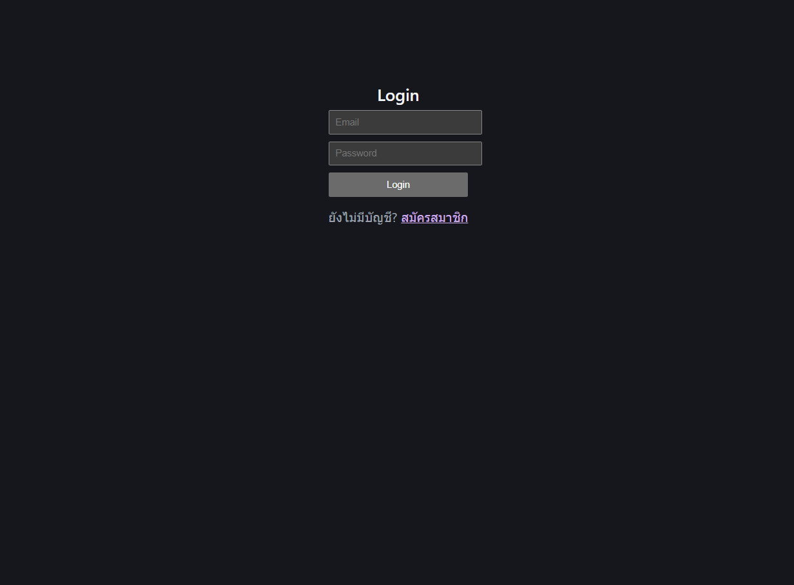
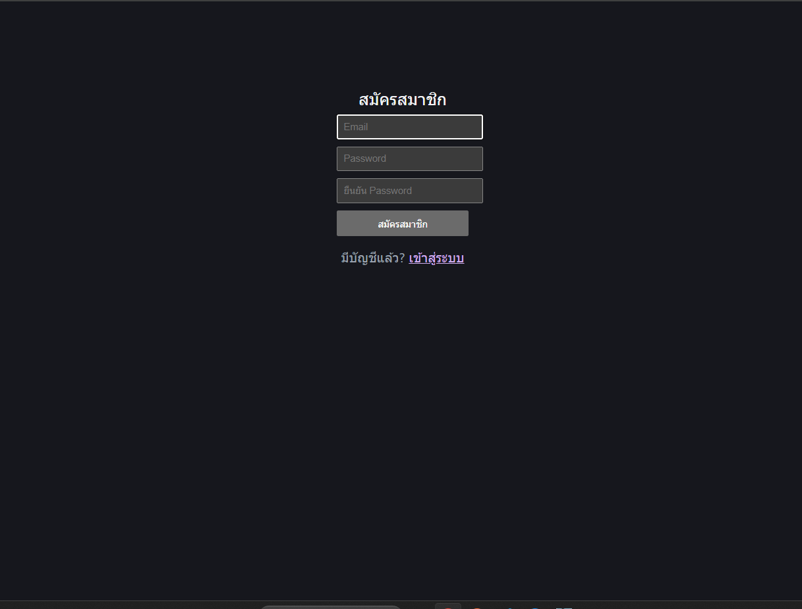
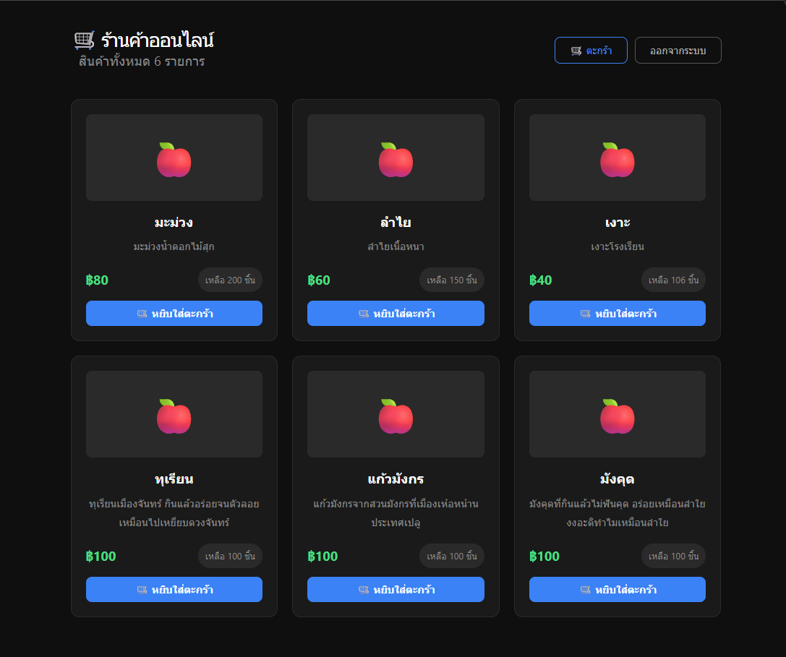
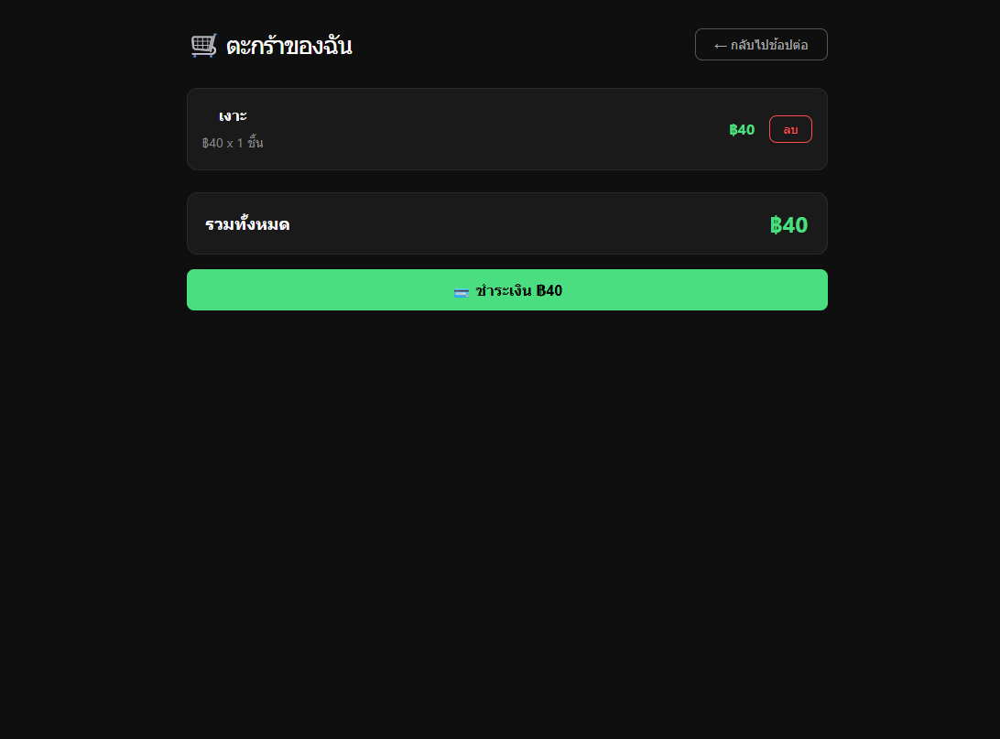

# 🍎 Fruit Shop — Frontend

React + Vite frontend สำหรับร้านผลไม้ออนไลน์แบบ microservices พร้อมชำระเงิน Omise

## ✨ Features

- Login / Register
- JWT refresh token อัตโนมัติ
- ดูสินค้า + admin เพิ่ม/ลบสินค้า
- ตะกร้าสินค้า + stock อัปเดต realtime
- Checkout + ชำระเงิน Omise (test mode)
- ประวัติออเดอร์

## 🛠️ Tech Stack

| Layer       | Technology            |
| ----------- | --------------------- |
| Framework   | React 19 + TypeScript |
| Build Tool  | Vite                  |
| Routing     | React Router v7       |
| HTTP Client | Axios                 |
| Payment     | Omise.js              |

## 🏗️ Architecture

```
Frontend (:5173)  ← this repo
  ├── Auth Service (Render)     → login, register, refresh
  └── API Gateway (:3004)       → products, cart, orders, payments
        └── Commerce API (:3000)
```

## 🔗 Related Repositories

| Service      | Repository                                                |
| ------------ | --------------------------------------------------------- |
| Commerce API | [commerce-api](https://github.com/panapolll/commerce-api) |
| API Gateway  | [Api-Gateway](https://github.com/panapolll/Api-Gateway)   |
| Auth Service | [Auth-Service](https://github.com/panapolll/Auth-Service) |

## 🚀 Getting Started

```bash
git clone https://github.com/panapolll/fruit-shop-frontend.git
cd fruit-shop-frontend
yarn install
cp .env.example .env
yarn dev
```

## ⚙️ Environment Variables

| Variable                | Description      | Example                                  |
| ----------------------- | ---------------- | ---------------------------------------- |
| `VITE_AUTH_API_URL`     | Auth Service URL | `https://auth-service-7xty.onrender.com` |
| `VITE_GATEWAY_URL`      | API Gateway URL  | `http://localhost:3004`                  |
| `VITE_OMISE_PUBLIC_KEY` | Omise public key | `pkey_test_xxx`                          |

## 📱 User Flow

```
Register → Login → Products → Cart → Checkout → Payment → Orders
```

## 🧪 Test Payment (Omise)

| Field  | Value                 |
| ------ | --------------------- |
| Card   | `4242 4242 4242 4242` |
| Expiry | `12/2028`             |
| CVV    | `123`                 |

## 📸 Screenshots

| Login                             | Register                                |
| --------------------------------- | --------------------------------------- |
|  |  |

| Products                                | Cart                            |
| --------------------------------------- | ------------------------------- |
|  |  |

| Payment                               |
| ------------------------------------- |
|  |

## 👤 Demo Account

| Role  | Email             | Password     |
| ----- | ----------------- | ------------ |
| Admin | `admin@gmail.com` | `1234567890` |

## 👨‍💻 Author

Portfolio project — microservices e-commerce.
